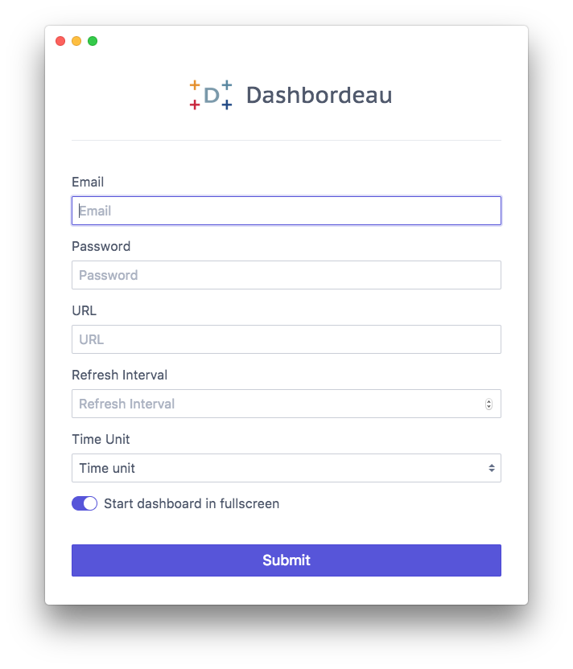

## Dashbordeur

Fullscreen dashboard with configurable auto-refresh intervals.git 

## Build
electron-icon-maker -i assets/icons/src/dashbordeur-round.png -o assets/

<!--
https://www.christianengvall.se/electron-menu/
https://github.com/webtorrent/webtorrent-desktop/blob/62cb304971cb867e5923044df9b7afa2c5f35e78/main/updater.js
https://github.com/webtorrent/webtorrent.io/blob/master/server/desktop-api.js

high level wrapper for electron-build and electron-packager
https://electronforge.io/
-->